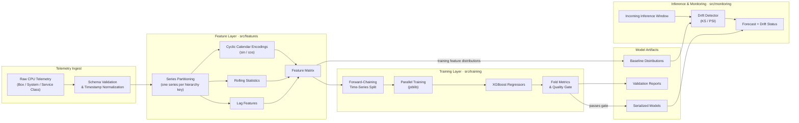
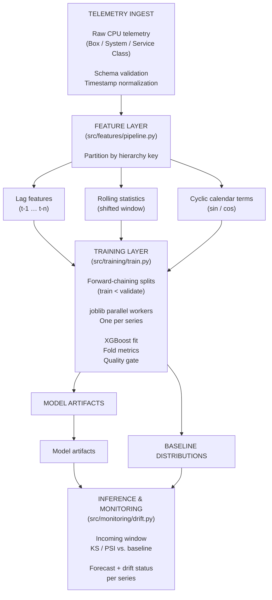

# Mainframe CPU Usage Forecasting Pipeline

> Production-oriented time-series forecasting for mainframe CPU telemetry, modeled concurrently across **Box → System → Service Class**, with leakage-safe validation and built-in data drift monitoring.

---

## Why This Exists

Mainframe capacity planning is expensive when it goes wrong in either direction:

| Failure Mode | Business Impact |
|---|---|
| **Under-forecasting** | Service degradation, missed SLAs, emergency capacity purchases |
| **Over-forecasting** | Idle capacity on consumption-priced platforms, inflated software licensing tiers |
| **Silent model decay** | Forecasts drift away from reality as workloads change, and nobody notices until an incident |

This pipeline addresses all three:

- **Hierarchical coverage.** One codebase trains an independent model for every Box / System / Service Class combination, so forecasts match the granularity at which capacity decisions are made.
- **Honest accuracy estimates.** Forward-chaining validation means reported error reflects what the model will do on future data, not on data it has effectively seen.
- **Continuous trust.** A drift monitor compares live inference windows against each model's training baseline and flags when a forecast should no longer be trusted.

---

## Key Capabilities

- **Concurrent multi-series training.** Series are trained in parallel with `joblib`; each is fully isolated, so one failure or short history does not block the others.
- **Reusable feature layer.** Abstract feature transformers for lag arrays, rolling statistics, and cyclic calendar encodings, composable and independently testable.
- **Temporal leakage prevention.** Expanding-window, forward-chaining cross-validation with an optional gap between train and validation folds.
- **Online drift detection.** Kolmogorov–Smirnov and Population Stability Index (PSI) checks against per-series training baselines.
- **Gradient-boosted forecasting.** XGBoost models on engineered features, chosen for strong tabular performance and fast retraining.

---

## Architecture

### Data Flow



### Data Flow (Visual Flowchart)



---

## Design Decisions

Each choice below is deliberate and explained, since these are the points that determine whether a forecasting system holds up in production.

### 1. Forward-chaining validation, not random K-Fold

Random splits place future observations in the training set while validating on the past, which lets the model learn from data that would not exist at prediction time. This inflates offline accuracy and produces disappointing production results. Forward-chaining always trains on the past and validates on the future, matching real deployment. An optional **gap** between train and validation windows prevents lagged and rolling features near the boundary from leaking information across it.

### 2. Shifted rolling windows

Rolling statistics are computed on values strictly before the prediction timestamp. Including the current observation in its own feature is a common and subtle leakage source.

### 3. Cyclic sine/cosine calendar encoding

Hour 23 and hour 0 are adjacent in time but far apart as integers. Encoding cyclic quantities (hour-of-day, day-of-week, month) as sine/cosine pairs preserves that adjacency and gives the model a smooth representation of daily and weekly workload cycles, such as batch windows and month-end processing.

### 4. Independent model per series

Box, System, and Service Class workloads have different baselines, seasonality, and volatility. Per-series models avoid forcing one global function to fit all of them, and they make retraining, rollback, and drift alerts granular. Because series are independent, training parallelizes cleanly.

### 5. Gradient-boosted trees

XGBoost handles nonlinear interactions between lags, rolling statistics, and calendar terms with modest tuning, trains quickly enough for frequent retraining, and gives feature importance for auditing.

### 6. Two complementary drift signals

- **Kolmogorov–Smirnov** is a nonparametric two-sample test that detects shape and location shifts without distributional assumptions.
- **PSI** gives a bounded, interpretable magnitude of shift that maps well to alert thresholds.

Using both reduces false alarms from either alone.

---

## Repository Layout

```text
mainframe-cpu-forecaster/
├── README.md
├── requirements.txt
└── src/
    ├── __init__.py
    ├── core/
    │   ├── __init__.py
    │   └── config.py        # Forecast horizons, lag defaults, split settings
    ├── features/
    │   ├── __init__.py
    │   └── pipeline.py      # Abstract transformers: lags, rolling stats, cyclic encodings
    ├── training/
    │   ├── __init__.py
    │   └── train.py         # Forward-chaining CV + parallel XGBoost training
    └── monitoring/
        ├── __init__.py
        └── drift.py         # Online KS / PSI drift detection
```

| Module | Responsibility |
|---|---|
| `core.config` | Single source of truth for forecast horizon, lag/rolling defaults, split counts, and thresholds |
| `features.pipeline` | Deterministic, leakage-safe feature generation behind a common transformer interface |
| `training.train` | Time-aware validation, parallel per-series training, quality gating |
| `monitoring.drift` | Baseline capture and drift evaluation of inference windows |

---

## Tech Stack

| Layer | Tools |
|---|---|
| Data & numerics | Python, NumPy, Pandas |
| Modeling | XGBoost, Scikit-Learn |
| Parallelism | joblib |
| Statistics | SciPy (KS test) |

---

## Getting Started

```bash
git clone <repository-url>
cd mainframe-cpu-forecaster
python -m venv .venv && source .venv/bin/activate
pip install -r requirements.txt
```

**Target usage** (illustrative; finalized as modules land):

```python
from src.features.pipeline import build_feature_pipeline
from src.training.train import train_all_series
from src.monitoring.drift import DriftMonitor

features = build_feature_pipeline().transform(telemetry_df)
results = train_all_series(features, n_jobs=-1)

monitor = DriftMonitor.from_baseline(results.baselines)
report = monitor.evaluate(incoming_window_df)
```

---

## Roadmap

- [x] Project scaffold and architecture
- [ ] Configuration layer (`core/config.py`)
- [ ] Feature engineering pipeline (`features/pipeline.py`)
- [ ] Forward-chaining training with parallel execution (`training/train.py`)
- [ ] Drift monitoring engine (`monitoring/drift.py`)
- [ ] Unit tests, including explicit leakage tests
- [ ] Model artifact versioning and registry integration
- [ ] Retraining triggers driven by drift status

---

## Status

Under active development. Interfaces may change until the first tagged release.

## License

To be determined.